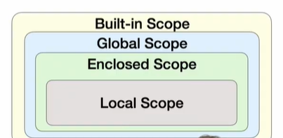

[toc]


# 함수

decomposition: logic을 분해하여 재사용할 수 있도록 함수를 사용한다!

abstraction: 재사용성, 가독성, 생산성 up!

**함수가 어떻게 동작하는지 그 원리를 이해하는 시간**

**max(), min() 사용을 지양할 것!**

선언과 호출, 입력, 문서화 ,범위, 결과값 순서!

## 1) 선언과 호출(define & call)

def 키워드사용

이후 들여쓰기하여 코드 블록 작성

retun 으로 마무리

```python
def 함수이름(input):
	........
	return output
```

**input 하는 object의 type에 따라 계산 결과가 달라질 수 있기 때문에 type 확인에 유의해야!**


## 2) 결과값(Output)

- return값 없으면 None 반환

```python
a = print('hello')			# print 해서 hello를 여기서 이미 봄, return 할 것이 없음
print(a)					# 따라서 여기서는 프린트할 것이 없음: None 출력
```

- return값 있으면  **값 반환 후 함수 바로 종료**

- return 받을 때 , 로 여러 값 표현하면 반환되는 값은 Tuple 로 작성되어 **오직 하나의 object**만 반환!

```python
def m(x,y):					# x = 2, y = 1
	return x+y, x-y
print(m(x,y))				# (3,1) 의 tuple 로 반환
print(type(m(x,y)))
```


## 3) 입력(Input)

- parameter: 함수 실행할 때 함수 내부에서 사용되는 식별자: 이름

- argument: 함수 호출 시 넣어주는 값

### 위치(positional), 키워드(keyword) (호출)

```python
def add(x,y):
	return x + y
	
print(add(1,2))		# 위치: 함수 내부에서 바인딩: x=1, y=2	
print(add(y=2,x=1))	# **키워드: 직접 x,y 값 지정: 키워드 지정하는 순간 위치는 박살남**
print(add(x=1,2))	# 키워드 먼저 하고 위치 사용 불가: 에러 뜸
print(add(2,y=1))	# 위치 먼저 하고 키워드 하는 건 사용 가능
```

### 위치,키워드(정의)

```python
def add(x,y=0):
    return x + y

print(add(2))		# y값은 지정되어있고 x값만 위치 잡아주거나 하면 되기에 작동한다: 2 + 0

def add(x=2,y):		# 호출과 마찬가지로 먼저 키워드 정해버리면 위치가 박살나기에 에러 뜸
    return x + y

print(add(2))
```

### positive arguments pack/unpack

```python
def add(*args):					# * 를 이용해서 여러 값을 하나의 tuple로 pack한다!
    return args, type(args)

print(add(1,2,3))				# (1,2,3) 이 되고 type은 tuple 이다.
print(add(1))					# (1) 이 되고 type은 tuple이다.
```

```python
def family(**kwagrs):			# ** 를 이용해서 dictionary 형태를 하나로 묶을 수 있다
    return kwagrs, type(kwagrs)

print(family(father = '고길동', monster = '둘리'))
# {father = '고길동', monster = '둘리'} 라는 dictionary로 출력된다.
# key를 정의내려 값은 불러오는 것이기에 ''을 사용하지 않는다!
```


## 4) 범위(Scope)

코드 내부의 local scope, 그 외의 공간인 global scope 로 구분

```python
def ham():
    a = 'spam'
    
ham()						# 아무 것도 정의되지 않음: a는 그냥 'spam'일 뿐 ham()과는 관련 x
print(a)					# 함수 내부(local)에서 정의된 a 이기에 global 에서는 이용 불가
```

Local < Enclosed < Global < Built-in 순서로 변수 찾아나서면 됨

각 scope에서 필요한 것 챙겨옴, 하위 scope에서 상위 scope로 나아갈 때 상위 scope에 

새롭게 선언된 변수 있으면 그걸로 사용!

```python
a = 0
b = 1
def enclosed():
    a = 10
    c = 3
    def local(c):
        print(a,b,c)			# a = 10, b = 1, c = 100
    local(300)					# 여기서 print되는 것
    print(a,b,c)				# a = 10, b = 1, c = 3
enclosed()						# 여기서 print 되는 것
print(a,b)						# a = 0, b = 1
```




- 함수 내부에서 global 변수 변경하고싶으면 'global 변수이름' 선언, **변수 쓰기 전에 선언해야!**

  global 쪽에 그 변수이름 존재하지 않아도 가능!

```python
a = 10
def func1():
    global a
    a = 3
    
print(a)				# a = 10
func()
print(a)				# a = 3
```

- 함수 내부에서 그 변수를 상위 함수에서 쓰고싶으면 'nonlocal 변수이름' 선언

  상위 함수에서 그 변수이름 존재해야만 가능!

```python
x = 0
def func1():
    x = 1
    def func2():
        nonlocal x
        x = 2
        
    func2()
    print(x)			# x = 2
    
func1()
print(x)				# x = 0
```

global, nonlocal 은 알고리즘 문제 풀 때 가끔 사용, **웬만하면 사용하지 말아야!!!**


## 5) 문서화(Doc-String)

함수나 클래스의 설명을 담은 곳

```python
def foo():
    '''
    여기에 설명 적으면 됩니다.
    
    '''

print(foo.__doc__)			# 위에 적은 설명이 출력된다
```

- Naming COnvention

  상수 : 전체 영문 대문자

  클래스, 예외 이름 : 각 단어의 첫 글자만 영문 대문자

  나머지 : 소문자,밑줄

  약어는 지양할 것


# 함수 응용


## 1) map

형태 : map(function, iterable)

iterable 한 것들의 object 형태를 변화시킬 때 사용

function 부분은 변화시키고 싶은 형태의 함수 이름 작성!

```python
numbers = [1,2,3]
result = map(str, numbers)			# 현재 numbers 내 objects는 int형, 그것들을 str형으로 
print(result, type(result))			# map값(지저분한 형태) 나오고 class 는 map으로 나옴
print(result)						# ['1', '2', '3'] 이 나옴
```


## 2) filter

형태 : filter(function, iterable)

function이 True일 때의 값들만 반환

```python
def odd(n):
    return n % 2
numbers = [1,2,3]
result = filter(odd,numbers)		# numbers list들 중에서 odd함수 조건 만족하는 것만 찾기
print(result, type(result))			# filter값(지저분한 형태) 나오고 class는 filter로 나옴
list(result)						# [1,3] 이 나옴
```


## 3) zip

형태 : zip(*iterables)

iterable 들을 각각의 index들끼리 묶어서 tuple로 표현

짧은 부분 기준으로 묶임, 남는 건 버려짐

```python
girls = ['jane', 'ashley']
boys = ['justin', 'eric']
pair = zip(girls, boys)				'''
									index 0인 'jane'과 'justin', index 1인 'ashley'와
									'eric' 이 서로 묶임
                                    '''
									
print(pair, type(pair))				# zip값(지저분한 형태) 나오고 class는 zip으로 나옴
list(pair)							# [('jane', 'justin'), ('ashley', 'eric')] 이 나옴
```


## 4) lambda

형태 : lambda [parameter] : 표현식

**함수 이름 없이 기능만 만들어** 그 결과를 사용하고싶을 때 씀

```python
def triangle_area(b, h):					# 일반적인 함수 정의
    return 0.5 * b * h
triangle_area(5, 6)

triangle_area = lambda b, h : 0.5 * b * h	# lambda를 활용한 함수 기능 생성
triangle_area(5, 6)
```


## 5) 재귀함수(recursive function)

자기 자신을 호출하는 함수

***1개 이상의 base case(종료되는 상황)존재, 수렴하도록 작성해야한다!***

```python
def factorial(n):
    if n == 0 or n == 1:
        return 1
    else:
        return n * factorial(n-1)			'''
        									끝나는(수렴하는) 부분 전까지는 거울처럼 
        									무한히 이어진다
        									''' 

factorial(4)								# 4 * 3 * 2 * 1 = 24 가 나온다	
```


## 기타

파이썬 자습서 검색 후 이용


