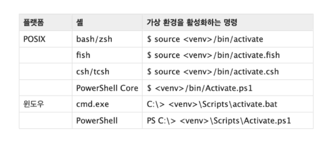

[toc]

# 모듈

다양한 기능(function)을 하나의 파일로 묶은 소스 코드!

파이썬 파일(.py) 단위로 작성

## 1) 불러오는 방법

import 'module'

from 'module' import 'var, function, class'

from 'module' import *

## 2) 만드는 방법

파일이름.py 내에 함수들 작성 후 저장

다른 파일 열어서 import 파일이름 , from 파일이름 import ... 등등 해서 사용 가능

---

---

# 패키지

다양한 모듈을 묶은 집합!

## 1) 불러오는 방법

from 'package' import module

from 'package'.'module' import 'var, fuction, class'

## 2) 만드는 방법

패키지로 쓸 폴더 내에 \__init__.py 파일이 있어야 한다!

\__init__.py 만들고 모듈들 모아놓으면 된다

## 3) 파이썬 패키지 관리자(pip)

PyPI(Python Package Index)에 저장된 외부 패키지들을 설치하도록 도와주는 패키지 관리 시스템

bash, cmd 환경에서 명령어 통하여 설치 가능

 ## 4) 가상환경

필요한 패키지 버젼이 이미 설치된 것과 다를 때 사용하면 좋음

폴더 생성 후 그 안에서 cmd/bash 열어 python -m venv' <폴더명> 작성

이후 아래의 명령어 작성

---

---

# 라이브러리

다양한 패키지를 묶은 집합!

## 1) 파이썬 표준 라이브러리

https://docs.python.org/ko/3/library/index.html